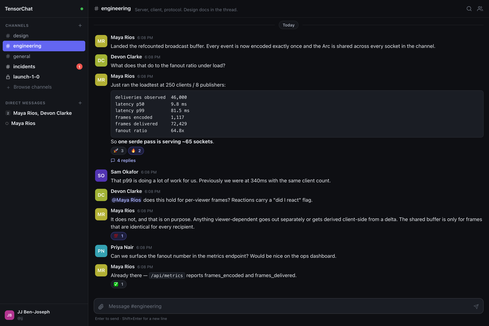
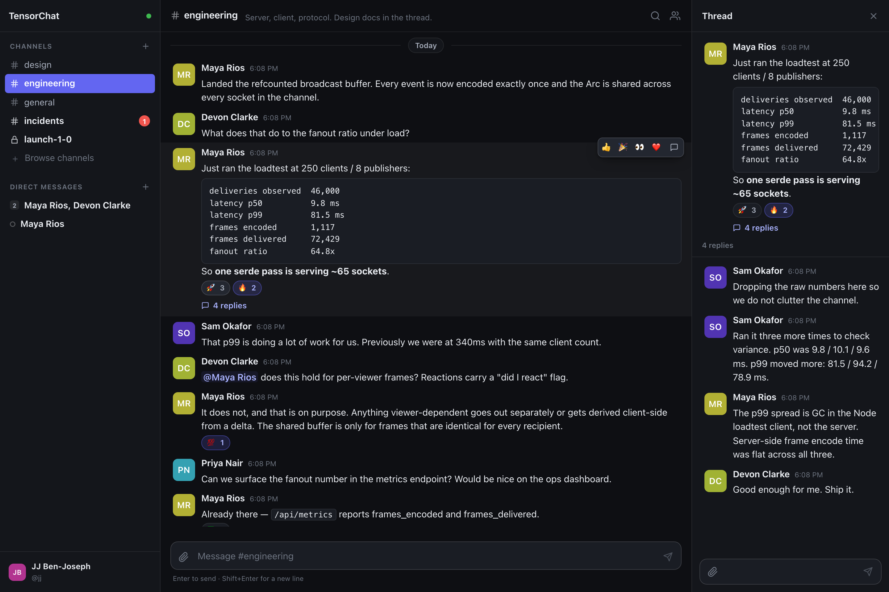
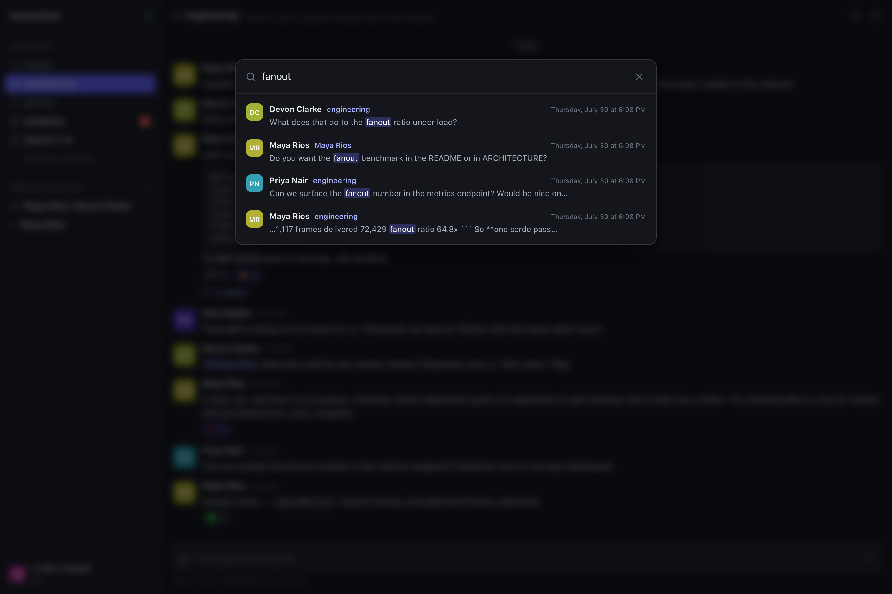
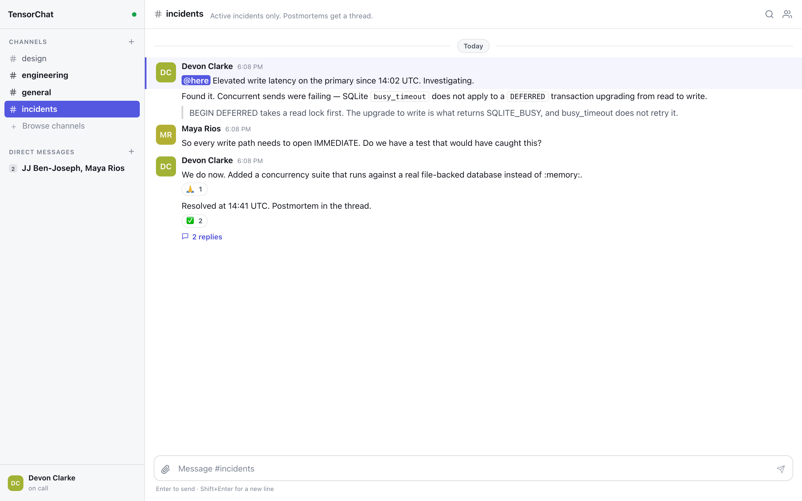
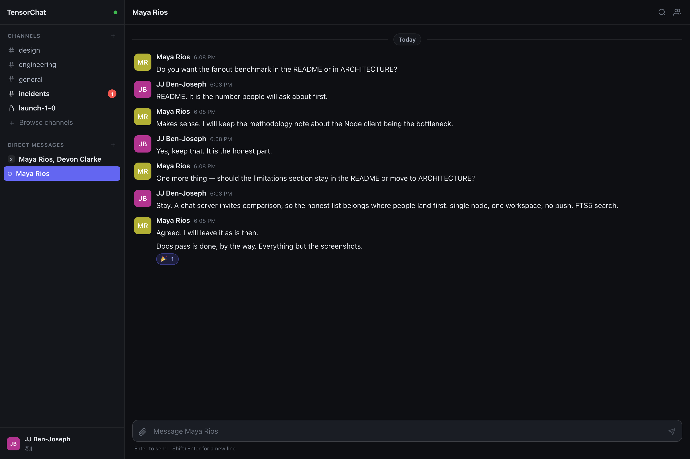

# TensorChat

[](https://github.com/tensorspace-ai/tensorchat/actions/workflows/ci.yml)
[](LICENSE)
[](https://www.rust-lang.org)

Team chat that runs on one box. A Rust server, an embedded database, and a
web client with no framework.

The goal is Slack's core, built so that a small deployment costs almost
nothing and a large one degrades gracefully: a single binary, a single SQLite
file, ~80 kB of JavaScript (29 kB gzipped) with no framework and no runtime
dependencies, and a realtime path that does one serialization per event rather
than one per recipient.



---

## Features

**Messaging** — channels (public and private), direct and group messages,
threaded replies, editing, deletion, emoji reactions with a searchable picker
and `:shortcode:` completion, file attachments, and `@mentions` with `@here` /
`@channel`. Private channels are invite-only, and any member can add or remove
people.

**Realtime** — WebSocket delivery of messages, reactions, typing indicators,
presence, membership changes, and read state, with automatic reconnection and
resynchronization.

**Reading** — unread and mention badges, a per-channel read cursor synchronized
across devices, pinned and saved messages, per-channel mute, and full-text
search with highlighted snippets, scoped to the channels you belong to. Queries
take `from:`, `in:`, `before:`, `after:` and `has:link` / `has:file` /
`has:image` operators, which also work on their own — `from:alice in:general` is
a valid search. Search hits and permalinks jump into the surrounding history
rather than dead-ending.

**Administration** — the first account is an administrator, and can promote
others or deactivate accounts. Deactivation signs the account out everywhere and
blocks sign-in while leaving its messages, mentions and threads intact.

**Invites** — with registration closed, administrators hand out invite links
that admit exactly the people they meant to. A link can be single-use or
multi-use, expiring or permanent, and is revocable at any time. The seat is
claimed in the same transaction that creates the account, so a single-use link
cannot admit two people who click it at once.

**Integrations** — bot accounts with long-lived API tokens. A token works as a
bearer credential on the whole HTTP API, and `POST /api/hooks/{token}` accepts
`{"channel": "...", "text": "..."}` for senders that cannot set headers. A bot
can only reach the channels it has been added to, so a leaked hook URL is
contained by membership like anything else.

**Notifications** — mentions and direct messages raise a notification, whether
or not a tab is open. Web Push wakes a service worker, which then fetches the
content from your own server, so message bodies never pass through Google's or
Mozilla's push infrastructure. Opt-in, and muted channels stay quiet.

**Installable** — a progressive web app: install it from the browser, launch it
standalone, and open it offline to a cached shell rather than a dinosaur.

**Client** — virtual-scrolled history that stays smooth over a hundred thousand
messages, optimistic sending, per-channel drafts that survive a reload, inline
message editing, mention autocomplete, drag-drop and paste-to-upload, a
System/Light/Dark theme toggle, and keyboard navigation.

---

## Screenshots

**Threads.** Replies live in a side pane, so a deep tangent never buries the
channel. The channel keeps a reply count and the hover bar offers quick
reactions.



**Search.** Full-text search over every channel you belong to, with the match
highlighted in the snippet. `⌘K` from anywhere.



**Light theme.** Follows the system preference by default, or pick one
explicitly in Preferences. Also visible here: `@here`, inline code, quotes, and
consecutive messages from one author collapsing into a single block.



**Direct messages.** One-to-one and group, in the same sidebar as channels.



---

## Quick start

Requires Rust 1.95+ (2024 edition) and Node 22+.

```sh
# Build the web client
cd web && npm install && npm run build && cd ..

# Run the server
cargo run --release -p tc-server
```

Open <http://127.0.0.1:8080> and create an account. The first account to
register becomes the workspace administrator. The first thing to do is make a
channel.

Upgrading an existing deployment does *not* pick an administrator for you —
promoting an arbitrary account would be a surprising grant of privilege. Choose
one deliberately:

```sh
sqlite3 tensorchat.db "UPDATE users SET admin = 1 WHERE handle = 'you';"
```

The database (`tensorchat.db`) and uploads (`blobs/`) are created on first run.
Nothing else is needed — no migration step to run, no services to start. Later
upgrades apply their schema changes on startup, so deploying a new version is
still just restarting the binary.

### With Docker

```sh
docker compose up -d
```

Same address. The database and uploads live in the `tensorchat-data` volume —
back that up and you have backed up everything. Published images are at
`ghcr.io/tensorspace-ai/tensorchat`.

The compose file binds to loopback on purpose. Put a TLS-terminating reverse
proxy in front before exposing it; the server speaks plain HTTP, and session
tokens are bearer credentials.

### Configuration

All configuration is environment variables. Everything has a working default.

| Variable | Default | Meaning |
| --- | --- | --- |
| `TC_BIND` | `127.0.0.1:8080` | Listen address. Set `0.0.0.0:8080` to accept external traffic. |
| `TC_DB` | `tensorchat.db` | SQLite database path. |
| `TC_BLOBS` | `blobs` | Directory for uploaded files. |
| `TC_WEB` | `web/dist` | Built frontend to serve. |
| `TC_NODE_ID` | `0` | Distinguishes ID generators if several instances share a database. |
| `TC_MAX_UPLOAD` | `26214400` | Maximum upload size in bytes. |
| `TC_OPEN_REGISTRATION` | `true` | Set `false` to close signups. Invite links still work — see below. |
| `TC_AUTH_BURST` | `10` | Login/register attempts allowed per client address before throttling. |
| `TC_AUTH_PER_SECOND` | `0.5` | Refill rate for that allowance. Raise both behind a proxy that hides client addresses. |
| `TC_PUSH_CONTACT` | `mailto:admin@localhost` | Contact address in VAPID tokens. Set to an empty string to disable Web Push. |
| `TC_PERMISSIVE_CORS` | `false` | Development only. |
| `RUST_LOG` | `tc_server=info` | Log filter. |

### Closing registration

`TC_OPEN_REGISTRATION=false` shuts the public sign-up form. Invite links still
work, so this is the setting most deployments want — but claim the
administrator account *before* you close it, because an empty closed workspace
has nobody who can mint the first invite:

```sh
# 1. Start open, register yourself at http://127.0.0.1:8080 (you become admin).
# 2. Restart with registration closed:
TC_OPEN_REGISTRATION=false cargo run --release -p tc-server
# 3. Preferences → Invite people → Create invite link.
```

An invite grants nothing but the right to create an account; the account it
makes is an ordinary member. Links are stored as a SHA-256 digest and shown
exactly once, so a lost link is reissued rather than recovered.

### Notifications

Web Push needs a **secure context**, which in practice means serving over HTTPS
(`localhost` is exempt, so development works unconfigured). Put the usual
reverse proxy in front and notifications start working with no further setup:
the VAPID keypair is generated into the database on first run and reused
afterwards.

Set `TC_PUSH_CONTACT` to a real address you are willing to be contacted at —
push services use it to report abuse from your server. Setting it to an empty
string turns the feature off, and clients then fall back to notifications that
only appear while a tab is open.

### Development

```sh
cd web && npm run dev     # rebuild the client on change
cargo run -p tc-server    # debug server
```

---

## How it works

Three crates, one clear dependency direction:

```
tc-core   domain types, wire protocol, ID generation   (no I/O)
   ↑
tc-store  SQLite: schema, queries, full-text search    (no async)
   ↑
tc-server axum: HTTP, WebSocket hub, authentication
```

[`ARCHITECTURE.md`](ARCHITECTURE.md) explains the design decisions in full. The
three that shape everything else:

**One encode per event, not per recipient.** Serialization dominates the
delivery path. A message to a channel with 500 connected members is encoded once
into a refcounted buffer that all 500 sockets share — so broadcasting costs one
`rmp_serde` pass and 500 atomic increments. This is only possible because every
broadcast frame is viewer-independent by construction; anything per-viewer (an
ack, a read receipt, a reaction's "did I react?" flag) is sent separately or
derived client-side from a delta.

**Snowflake IDs, used as everything.** Every entity is keyed by a time-sortable
u64. That one choice makes the primary key double as the pagination cursor and
the time index: history is `WHERE channel_id = ? AND id < ? ORDER BY id DESC`,
a pure descending index scan with no offset, no sort, and no timestamp column.
Jumping to a message is the same index read in both directions from an anchor.
Message timestamps are recovered from the ID, so they cost nothing on the wire.

**SQLite, in process.** A chat server's working set is "the last few hundred
messages in the channels I have open" — a page-cache problem, not a distributed
one. Running the database in-process removes a network hop and a serialization
round trip from every read. WAL mode gives concurrent readers alongside a
writer, which is exactly the shape of the workload.

---

## Measuring it

The load generator opens N WebSocket clients in one channel, publishes from a
few of them, and reports end-to-end latency plus the fanout amplification the
server achieved. It has no dependencies — Node's built-in WebSocket client and
the same MessagePack codec the browser uses.

```sh
node tools/loadtest.mjs --clients 250 --publishers 8 --rate 2 --seconds 12
```

On an M-series laptop, 250 connected clients in one channel:

```
  connections         250
  sends accepted      184
  deliveries observed 46,000
  delivery rate       3,678/s
  observed / expected 100.0%

  latency p50         9.8 ms
  latency p99         81.5 ms

  frames encoded      1,117
  frames delivered    72,429
  dropped consumers   0
  fanout ratio        64.8x
```

The last number is the point: each serialization served ~65 sockets. A server
that encoded per recipient would have run serde 65 times as often for the same
delivery.

Note that a single Node process decoding hundreds of sockets becomes the
bottleneck before the server does; the tool says so when it detects that, rather
than reporting its own backlog as server loss.

---

## Testing

```sh
cargo test --workspace     # 202 tests
cd web && npm test         # 110 tests
cd web && npx tsc --noEmit # type check
```

The suite covers unit behavior, HTTP integration against the real router
(authorization, rate limiting, security headers, the full message lifecycle),
and concurrency against a real file-backed database. That last group exists
because of a bug it caught: SQLite's `busy_timeout` does not apply to a
`DEFERRED` transaction upgrading from read to write, so concurrent sends failed
until every write path was switched to `IMMEDIATE`.

---

## Security

Passwords are Argon2id. Sessions are opaque 256-bit random tokens, stored only
as a SHA-256 digest, so a database dump yields no usable sessions and logout is
a `DELETE` rather than a blocklist entry. Login answers identically whether an
account exists or the password was wrong, including in timing. Changing a
password signs out every other device, because a session is a bearer token that
would otherwise outlive the password it was issued against.

Channel membership is checked inside the same transaction as every write, and
search joins against membership rather than filtering afterwards, so a query
cannot leak a private channel.

The client builds DOM nodes and never HTML strings — no `innerHTML` anywhere —
so message content cannot become markup. That is what lets the app ship a
Content-Security-Policy with no `unsafe-inline`. Uploads are served from a short
allowlist of content types and forced to download otherwise, so an uploaded
`.svg` or `.html` cannot execute on the origin.

---

## Limitations

Honest ones, since a chat server invites comparison:

- **Single node.** The hub's routing table is in-process. Multiple instances
  behind a load balancer would need a shared bus; `TC_NODE_ID` reserves ID space
  for that, but the work is not done.
- **One workspace per deployment.** Multi-tenancy would mean a workspace column
  on every table and a join on every query.
- **The user directory ships whole at connect.** Fine into the low thousands;
  beyond that it needs paging.
- **No outbound integrations.** Incoming webhooks exist; there is nothing that
  calls *out* to another service, and no slash commands.
- **No Web Push.** Desktop notifications work while a tab is open; waking a
  device with no page open would need a service worker, VAPID keys, and a
  subscription store. No voice, no calls, no bridges.
- **Search is FTS5.** Excellent for message bodies, not a relevance-tuned
  engine.

---

## Contributing

Bug reports, fixes, and features are welcome. [`CONTRIBUTING.md`](CONTRIBUTING.md)
covers the build, what CI checks, and the design constraints that are
load-bearing — read the last of those before proposing anything large.

Found a security issue? Please report it privately: see
[`SECURITY.md`](SECURITY.md).

Release notes are in [`CHANGELOG.md`](CHANGELOG.md).

## License

[MIT](LICENSE) © TensorSpace, Inc.
